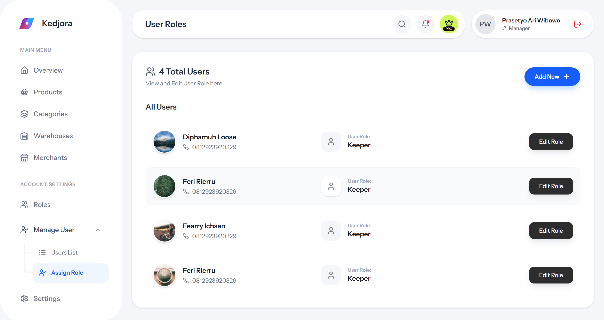
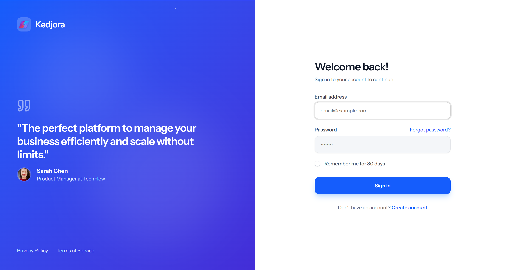
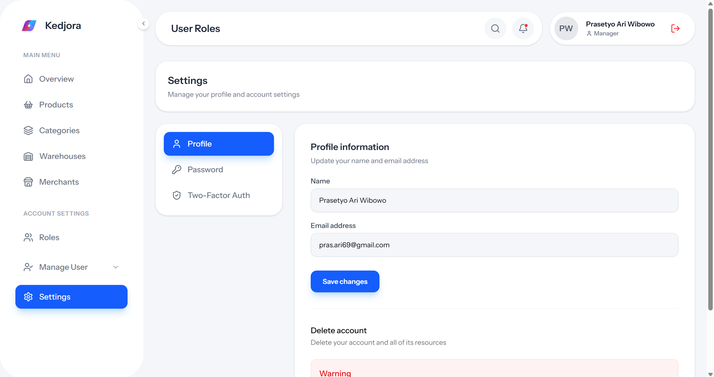

# Kedjora Dashboard

A modern dashboard application built with Laravel 12 and React, featuring a clean Kedjora-style UI design.

## Tech Stack

- **Backend:** Laravel 12
- **Frontend:** React 19 with TypeScript
- **Styling:** Tailwind CSS 4
- **Build Tool:** Vite
- **Authentication:** Laravel Fortify

## Screenshots

### Dashboard


### Login


### Profile Settings


## Features

- 🔐 Authentication (Login, Register, Forgot Password)
- 👤 User Management
- ⚙️ Settings (Profile, Password, Appearance, Two-Factor Auth)
- 🎨 Modern UI with Kedjora-style design
- 📱 Responsive layout

## Requirements

- PHP >= 8.2
- Composer
- Node.js >= 18
- MySQL / PostgreSQL / SQLite

## Installation

1. **Clone the repository**
   ```bash
   git clone https://github.com/Kedjora/template-dashboard.git
   cd template-dashboard
   ```

2. **Install PHP dependencies**
   ```bash
   composer install
   ```

3. **Install Node.js dependencies**
   ```bash
   npm install
   ```

4. **Environment setup**
   ```bash
   cp .env.example .env
   php artisan key:generate
   ```

5. **Configure database**
   
   Update `.env` file with your database credentials:
   ```env
   DB_CONNECTION=mysql
   DB_HOST=127.0.0.1
   DB_PORT=3306
   DB_DATABASE=your_database
   DB_USERNAME=your_username
   DB_PASSWORD=your_password
   ```

6. **Run migrations**
   ```bash
   php artisan migrate
   ```

7. **Build assets**
   ```bash
   npm run build
   ```

## Development

Start the development server:

```bash
# Terminal 1 - Laravel server
php artisan serve

# Terminal 2 - Vite dev server
npm run dev
```

Access the application at `http://localhost:8000`

## Scripts

| Command | Description |
|---------|-------------|
| `npm run dev` | Start Vite development server |
| `npm run build` | Build assets for production |
| `npm run lint` | Run ESLint |
| `npm run format` | Format code with Prettier |
| `npm run types` | TypeScript type checking |

## Project Structure

```
├── app/
│   ├── Http/
│   │   ├── Controllers/
│   │   └── Middleware/
│   ├── Models/
│   └── Providers/
├── resources/
│   ├── css/
│   │   └── app.css
│   ├── js/
│   │   ├── components/
│   │   ├── hooks/
│   │   ├── layouts/
│   │   ├── lib/
│   │   ├── pages/
│   │   ├── routes/
│   │   └── types/
│   └── views/
├── routes/
│   ├── web.php
│   └── settings.php
└── public/
    └── assets/
        └── images/
```

## License

This project is open-sourced software licensed under the [MIT license](https://opensource.org/licenses/MIT).

## Author

**Kedjora**

---

Made with ❤️ using Laravel & React
